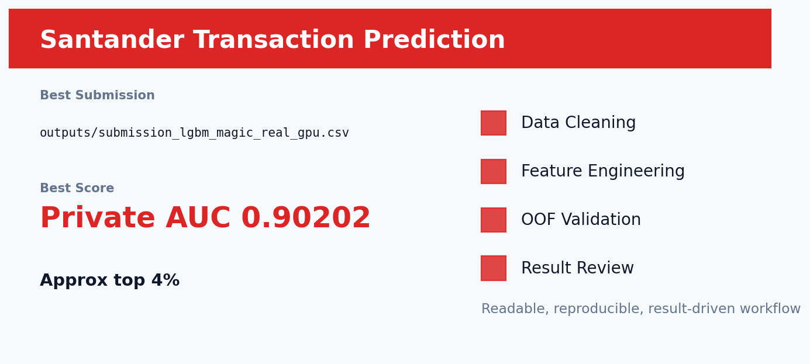

# Kaggle Santander 银行交易预测：读懂数据生成机制比堆模型更重要



## 这个项目在简历里的定位

这是整个作品集中最亮眼的结构化项目之一。它展示的不是简单调 LightGBM，而是通过 EDA 识别测试集真实/合成样本机制，再把这种数据理解转化成线上分数。

## 业务问题与评价指标

根据 200 个匿名数值特征预测客户是否会完成交易，指标为 ROC-AUC。业务上可以理解为银行交易意向预测，用于营销触达和客户筛选。

当前最佳为 `outputs/submission_lgbm_magic_real_gpu.csv`，Public AUC `0.90438`，Private AUC `0.90202`，OOF AUC `0.903792`，约 public leaderboard 前 4%。

## 我的整体解决思路

我把这个项目拆成五步：

1. **先理解数据**：看目标分布、字段类型、缺失模式、train/test 差异和指标特点。
2. **再做清洗**：把明显的脏值、哨兵值、语义缺失和泄露风险处理干净。
3. **重点做特征工程**：不是机械造列，而是把业务直觉、数据结构和模型能力连接起来。
4. **用 OOF 做验证**：每个模型都尽量通过交叉验证产生 OOF，避免只看一次线上提交。
5. **最后复盘取舍**：线上不涨的复杂方案不保留，最终只保留稳定、能解释、能复现的版本。

## EDA 与数据理解

- 200 个变量全部匿名，无法靠字段名做业务解释，因此重点转向分布、重复值、唯一值和 train/test 差异。
- EDA 发现测试集存在真实样本与合成样本混合的机制，这是普通建模很容易忽略的关键。
- 目标是 AUC，因此模型要把正负样本排序排准，而不是只追求概率校准。

## 数据清洗策略

- 保持匿名数值变量的原始尺度，不做会破坏排序结构的过度标准化。
- 严格排除 ID 和目标列，所有统计特征只从允许数据中构造。
- 对 train/test 分布进行检查，把测试集机制作为建模策略的一部分。

## 特征工程：不是堆字段，而是写入业务逻辑

| 特征设计 | 为什么这样构造 | 预期收益 |
| --- | --- | --- |
| 真实/合成测试识别 | 测试集并非完全同分布，识别真实测试行能显著改善提交。 | 这是项目最大的提分点。 |
| 频次与唯一值模式 | 匿名变量中的重复值和稀有值暗含生成机制。 | 帮助模型识别非随机结构。 |
| 统计增强 | 单个匿名变量含义未知，但整体统计形态仍有信息。 | 补充原始特征之外的分布信号。 |
| 保留数值原貌 | LightGBM 能直接学习数值切分，过度变换可能损失信号。 | 让模型最大化利用匿名变量。 |

这部分是整个项目最值得讲的地方。我的处理原则是：**先解释变量为什么可能影响目标，再决定把它做成比例、计数、交叉、分箱、rank、文本向量还是序列语义表示**。这样做出来的特征不是“玄学调参”，而是有业务含义、有验证闭环的建模资产。

## 模型选择：为什么用这些模型

- GPU LightGBM 是主模型：速度快、对高维匿名数值特征非常强。
- 5 折 OOF 用来确认本地 AUC 与线上 AUC 是否一致。
- 最终围绕 real/synthetic test detection 生成 magic real 版本，而不是盲目加模型。

我没有把模型当成黑箱堆叠，而是根据数据形态选择模型：结构化数据优先树模型，类别特征多时重视 CatBoost，高维匿名数值用 LightGBM，文本任务则先用 TF-IDF 建强 baseline，再用 Transformer 补语义理解。

## 验证与防止过拟合

- 使用 OOF 或交叉验证观察本地泛化表现。
- 区分 public/private 分数，避免过度追逐单次 public leaderboard。
- 严格排除 ID、target、后竞赛标签等泄露来源。
- 对融合方案做线上复盘：如果复杂方案不涨分，就回退到更稳定版本。

## 运行结果分析

- 这个项目的精妙之处在于先理解数据机制，再建模。
- Private AUC `0.90202` 说明 EDA 发现真正转化成了线上收益。
- 对于金融匿名数据，字段不可解释并不代表无法解释方法；可以解释的是分布、机制和风险排序逻辑。

## HR/面试官能看到什么能力

- **数据理解能力**：不是直接调包，而是先通过 EDA 找到数据里的结构和风险点。
- **特征工程能力**：能把业务问题翻译成模型可学习的变量。
- **模型选择能力**：知道什么时候用 CatBoost、LightGBM、XGBoost、线性模型或 Transformer。
- **实验复盘能力**：能解释为什么某个方案涨分，为什么某个方案被放弃。
- **工程整理能力**：保留最佳提交、实验日志、结果检查和 GitHub 展示文档。

## 如何复现

安装依赖：

```bash
pip install -r requirements.txt
```

复现时先从 Kaggle 下载原始数据到项目约定的数据目录。部分仓库为了保持轻量，只保留最佳提交文件、实验日志和核心说明；如果仓库中存在 `src/`、`notebooks/` 或 `kaggle_kernel_*`，优先从这些入口运行训练。

常见入口示例：

```bash
python src/train_best.py
# 或在 Kaggle 上运行 kaggle_kernel_* 中的 GPU kernel
```

如果当前项目只保留了最佳产物，可直接查看 `outputs/` 中的 OOF、prediction、submission 和实验摘要文件。

## 后续改进方向

- 继续挖掘重复值、唯一值、频次模式和变量组合。
- 补充 top feature importance，解释匿名变量虽然没有业务名，但哪些变量贡献最大。
- 尝试多 seed LightGBM/CatBoost 融合，但不偏离 real-test 识别主线。
